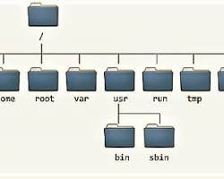

# Linux For Dummies - Power Of The Shell

## Introduction

Welcome to the world of the Linux shell! This powerful tool is your gateway to interacting with the operating system and controlling its behavior. Think of it as your command center, where you can issue orders, manage files, and customize your environment.

In this guide, we'll explore the basics of the Linux shell, covering topics like:

- Installation
- The Linux Filesystem
- [Navigating the Linux Filesystem](./NAVIGATING.md)

## Installation:

### Windows:

**There are primarily two ways to install Linux on Windows:**

1. **Virtualization**: This involves running a virtual machine (VM) software on your Windows system and installing Linux within the VM. This provides a fully isolated environment for your Linux installation.
2. **Windows Subsystem for Linux (WSL)**: This is a lighter-weight option that allows you to run Linux environments directly within Windows.

#### Method 1: Virtualization

1. Install Virtualization Software:

    * Choose a virtualization software like VirtualBox, VMware Player, or Hyper-V.
    * Download and install the software on your Windows system.

2. Create a New Virtual Machine:

    * Launch the virtualization software and create a new virtual machine.
    * Select the appropriate settings for your VM, such as memory allocation, processor cores, and storage.

3. Install Linux in the VM:

    * Download the ISO image of your desired Linux distribution.
    * Mount the ISO image in the VM's CD/DVD drive.
    * Start the VM and follow the on-screen instructions to install Linux.

#### Method 2: Windows Subsystem for Linux (WSL)

1. Enable WSL:

    * Open Windows PowerShell or Command Prompt as an administrator.
    * Run the following command:

        ```PowerShell
        dism.exe /online /enable-feature /featurename:Microsoft-Windows-Subsystem-Linux # Use code with caution.
        ```
    * Restart your computer.


2. Install a Linux Distribution:

    - Open the Microsoft Store and search for the Linux distribution you want (e.g., Ubuntu, Debian, Kali).
    - Install the desired distribution.
    - Run the Linux Distribution:
        1. Open the Start menu and search for the name of your Linux distribution.
        2. Click on the icon to launch the Linux terminal.
        3. Choosing a Linux Distribution

## Linux distributions:

The choice of Linux distribution depends on your specific needs and preferences. Some popular options include:

    1. Ubuntu: User-friendly and widely supported.
    2. Debian: Stable and reliable.
    3. Fedora: Cutting-edge features and community-driven.
    4. Arch Linux: Highly customizable but requires more technical knowledge.
    5. Kali Linux: Designed for penetration testing and security auditing.

## The Linux Filesystem

In the world of Linux, the filesystem structure is a bit different from what you might be used to in Windows.
Instead of a physical drive like C:, Linux utilizes a logical filesystem that's organized hierarchically.



### /: The Root Directory

At the pinnacle of this structure is the / directory, often referred to as the "root" directory.
Think of it as the base of an inverted tree, where all other directories and files branch out from.
It's important to note that this "root" directory is distinct from the "root" user, which is a special account with administrative privileges.

### /root: The Home of the Superuser

The /root directory is the home directory of the root user, the all-powerful administrator account in Linux. This directory houses the personal files and configurations of the root user.

### /etc: The Configuration Center

The /etc directory is a treasure trove of configuration files that control how various programs and services behave. These files determine everything from network settings to system startup procedures.

### /home: Your Personal Space

The /home directory is where the individual home directories of regular users are located. Each user's home directory contains their personal files, documents, and settings.

### /mnt and /media: Mounting Points

The /mnt and /media directories are typically used as mounting points for external filesystems. When you connect a USB drive or insert a CD, the Linux system will mount the device to one of these directories, making its contents accessible within the main filesystem.

### /bin and /lib: The Essentials

The /bin directory houses essential binary executables, the equivalent of Windows' .exe files. These are the programs that you directly run from the command line. The /lib directory contains libraries, shared code that other programs can use.

### A Note on Security

It's crucial to remember that logging in as the root user should be reserved for administrative tasks only. For everyday activities, it's safer to log in as a regular user to minimize the risk of accidental damage or security breaches.

### Getting Started - Prompt and Commands

```zsh
profilename@machinename$ 
```

This is the standard command prompt you'll see when logged into a Linux system. The profilename part represents your username,
while machinename is the name of the computer or server you're connected to.

#### Finding Your Current Directory:

To determine your current working directory within the filesystem, use the pwd command:

```zsh
profilename@machinename$ pwd
/home/profilename
```

This will output the path to your current directory, which is typically your home directory (/home/profilename) when you first log in.

#### Checking Your Logged-in User:

To verify the username of the user currently logged in, use the whoami command:

```zsh
profilename@machinename$ whoami
profilename
```

This will print your username, confirming that you're logged in as the expected user.

### [Getting Help](./getting-help/GETTINGHELP.md)
### [Navigating The Linux Filesystem](./navigating/NAVIGATINGLINUXFILESYSTEM.md)
### [Searching](./searching/SEARCHING.md)

### Notes:

1. Sourcing the Script:
    
    If running the script navigating.sh doesn't immediately update your terminal, use the following command:

    ```zsh
    . ./navigating.sh
    ```

The . (dot) operator tells the shell to execute the commands in the script within your current shell session instead of a subshell.

2. Wildcards for Pattern Matching:

    Bash wildcards offer flexible ways to match file names. Here's a breakdown of common wildcards:

    - *: Matches any sequence of characters (zero or more characters).
    - ?: Matches exactly one character.
    - []: Encloses a set of characters to match any one character within the set.

        Examples:

        ```zsh
        find --name filename?.txt  # Matches filenames.txt and any other file with a single character before ".txt".
        find --name filename*      # Matches filenames, filename.txt, and even filename.something.
        find --name filename[s,d]  # Matches filenames or filenamed only.
        ```
